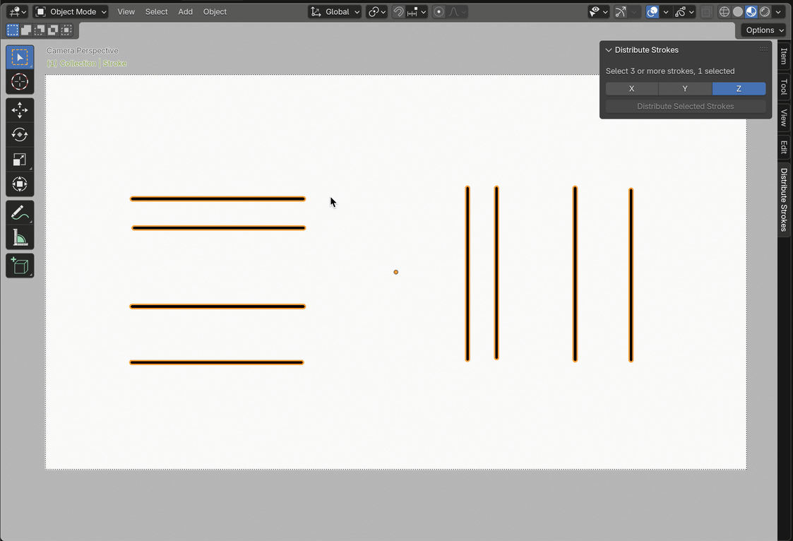

# Distribute Grease Pencil Strokes

A Blender add-on to evenly distribute selected Grease Pencil strokes along the X, Y, or Z axis.

## Description
The **Distribute Grease Pencil Strokes** add-on allows users to select three or more Grease Pencil strokes and distribute them evenly along a chosen axis (X, Y, or Z) in the 3D Viewport. This is useful for creating uniform arrangements of strokes in Grease Pencil.

## Features
- Distribute selected Grease Pencil strokes along the X, Y, or Z axis.
- User-friendly interface in the 3D Viewport sidebar.
- Supports undo for easy adjustments.
- Displays the number of selected strokes and provides feedback if fewer than three are selected.

## Compatibility
- **Blender Version**: 4.4.0 or later
- **Category**: Grease Pencil

## Installation
1. Download the `distribute_grease_pencil_strokes-1.0.1.zip` file from this repository.
2. Open Blender and navigate to `Edit > Preferences > Extensions`.
3. Click `Install from Disk...` and select the `.zip` file.
4. Enable the add-on by checking the box next to "Grease Pencil: Distribute Grease Pencil Strokes".
5. The add-on panel will appear in the 3D Viewport sidebar under the "Distribute Strokes" tab.

## Usage
1. Select a Grease Pencil object.
2. Select three or more strokes in the Grease Pencil object.
3. Open the 3D Viewport sidebar (press `N` if hidden).
4. Locate the **Distribute Strokes** tab.
5. Choose the desired axis (X, Y, or Z) for distribution.
6. Click the **Distribute Selected Strokes** button to evenly space the strokes.
7. Use `Ctrl+Z` to undo if needed.

**Note**: The add-on requires at least three selected strokes to function. The panel will display the number of selected strokes or a warning if fewer than three are selected.

## Demo
The following GIF demonstrates how to use the add-on to distribute Grease Pencil strokes along the Z-axis:

## For Blender Extensions Platform
This add-on includes a `blender_manifest.toml` file for compatibility with the Blender Extensions platform (Blender 4.2+). The add-on is structured as a Python module (`distribute_grease_pencil_strokes/__init__.py`). To submit to [extensions.blender.org](https://extensions.blender.org), package the add-on as a `.zip` with the manifest, module files, README, LICENSE, and optional demo GIF.

## License
This add-on is licensed under the GNU General Public License (GPL) v3. See the [LICENSE](LICENSE) file for details.

## Support
For issues, feature requests, or contributions:
- Create an issue on this [repository](https://projects.blender.org/JohnNyquist/distribute_grease_pencil_strokes/issues)
- Contact the author: John Nyquist <blender@nyquist.net>

## Contributing
Contributions are welcome! Please fork the repository, make your changes, and submit a pull request. Ensure your code follows the [Blender API Best Practice guidelines](https://docs.blender.org/api/current/info_best_practice.html).

## Author
- **John Nyquist BFCT**

## Version History
- **1.0.2** (2025-07-07): Now works with multiple layers. Better feedback.
- **1.0.1** (2025-06-01): Registering with WindowManager. Fixed manifest and updated.
- **1.0.0** (2025-05-31): Initial release with support for Blender 4.4.0.

---
*This add-on is not affiliated with the Blender Foundation.*
